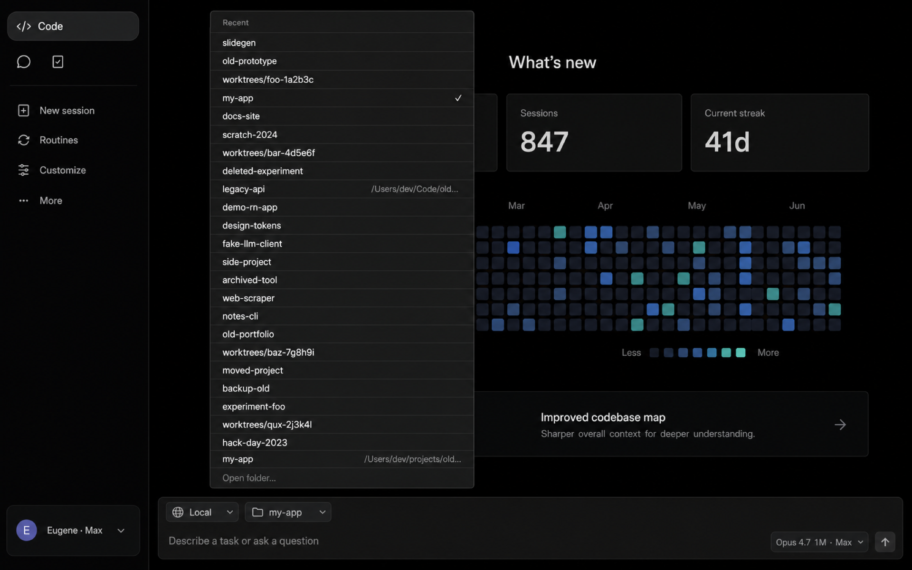
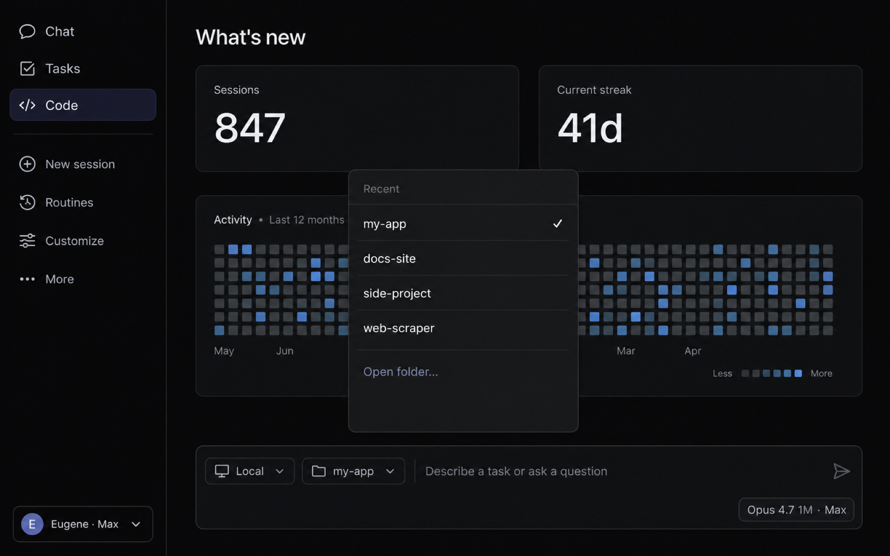

# Claude Recents Cleaner

**Clear stale projects from the Recent dropdown in the Claude desktop app (Claude Code).**

If you've reorganized, renamed, or deleted project folders, the "Recent" project picker
in Claude desktop keeps showing the old names — sometimes dozens of them. This is a
small Python script that removes the stale entries so the dropdown reflects what
actually exists on your disk.

Works on **macOS, Linux, and Windows**. Single file, no dependencies (stdlib only).

```bash
# macOS / Linux
brew install bisovka-labs/tap/claude-recents-cleaner
claude-recents-cleaner --dry-run

# Or run the script directly
python3 clean-claude-recents.py --dry-run
```

<table>
  <tr>
    <th align="center">Before — cluttered with ghosts</th>
    <th align="center">After — only real projects</th>
  </tr>
  <tr>
    <td></td>
    <td></td>
  </tr>
</table>

## The problem

The Claude desktop app's `Code` tab ("New session → folder picker") shows a "Recent"
list of projects you've worked in. Over time, as you rename folders, delete old
prototypes, or clean up `.claude/worktrees/...` worktrees, that list fills up with
ghosts — paths to folders that no longer exist. Clicking one shows "folder not
found" or simply does nothing.

The desktop app does not currently provide a UI to remove individual entries from
the Recent list, and quitting and relaunching does not clear them either.

## How the Recent list is actually stored

The dropdown is built from one JSON file per session, stored under your operating
system's Claude application-support directory:

| OS | Path |
|---|---|
| macOS | `~/Library/Application Support/Claude/claude-code-sessions/` |
| Linux | `~/.config/Claude/claude-code-sessions/` |
| Windows | `%APPDATA%\Claude\claude-code-sessions\` |

Each file (`local_<uuid>.json`) records the project's `cwd`, a title, the model
used, and timestamps. The Recent dropdown enumerates these files, dedupes by `cwd`,
and shows the basename.

`~/.claude.json` (project-level settings like trusted-folder, allowed-tools, MCP
config) and `~/.claude/projects/` (the actual conversation JSONL transcripts) are
**not** the source for the Recent dropdown. This tool deliberately does not touch
either of them.

## What this tool does

1. Scans `claude-code-sessions/` for session metadata files.
2. Reads the `cwd` from each file.
3. If the folder no longer exists, marks the session for removal.
4. Optionally (with `--days N`): also removes sessions whose last activity is
   older than `N` days, even if the folder still exists.
5. Backs up every file it removes into a single timestamped `.tar.gz` in your
   home directory (so any deletion is reversible).
6. Deletes the marked files.

After you relaunch Claude.app, the Recent dropdown reflects the cleaned state.

The actual chat history (the JSONL transcripts in `~/.claude/projects/`) is **never
touched**. If you ever want to resume a conversation whose metadata you cleaned up,
the transcript is still on disk and `claude --resume <session-id>` can open it.

## Install

### Homebrew (macOS, Linux)

```bash
brew install bisovka-labs/tap/claude-recents-cleaner
```

Then run it as `claude-recents-cleaner` from anywhere.

### Manual (any platform)

```bash
git clone https://github.com/bisovka-labs/claude-recents-cleaner.git
cd claude-recents-cleaner
python3 clean-claude-recents.py --dry-run
```

Or download just the script:

```bash
curl -O https://raw.githubusercontent.com/bisovka-labs/claude-recents-cleaner/main/clean-claude-recents.py
python3 clean-claude-recents.py --dry-run
```

Requires Python 3.8+. No third-party packages.

## Usage

1. **Quit Claude.app completely.** On macOS press `Cmd+Q` (not just close the window).
   The desktop app may rewrite session metadata on exit, undoing your changes if it's
   still running.

2. Run the cleaner from a regular terminal:

   ```bash
   # See what would be removed (no changes made)
   python3 clean-claude-recents.py --dry-run

   # Remove sessions for folders that no longer exist
   python3 clean-claude-recents.py

   # Additionally remove sessions older than 30 days
   python3 clean-claude-recents.py --days 30

   # Aggressive — keep only the last week
   python3 clean-claude-recents.py --days 7
   ```

3. Relaunch Claude.app. The Recent dropdown is now clean.

If you ever need to restore a removed session:

```bash
# macOS / Linux
tar -xzf ~/claude-recents-backup-YYYYMMDD-HHMMSS.tar.gz \
    -C "~/Library/Application Support/Claude/claude-code-sessions/<org-uuid>/<user-uuid>/"
```

(Replace the `org-uuid`/`user-uuid` segment with the subdirectory that already exists
under `claude-code-sessions/` on your machine.)

## Options

```
--dry-run        Print what would be removed without deleting anything.
--days N         Also remove sessions whose last activity is older than N days.
--force          Skip the "is Claude.app running" guard. Not recommended.
```

## FAQ

**Will this delete my chat history?**
No. This tool removes session *metadata* (cwd, title, model, timestamps) from
the desktop app's directory. The conversation transcripts themselves live in
`~/.claude/projects/<flattened-path>/<session-id>.jsonl` and are untouched.

**Does it work on Claude Code CLI without the desktop app?**
The Recent dropdown is a desktop-app feature. If you only use the CLI, the
sessions directory may not even exist on your machine and the script will be a
no-op. The CLI's per-project state lives in `~/.claude.json` (not handled here).

**Why not just edit `~/.claude.json`?**
That file contains per-project settings (trusted-folder, allowed tools, MCP
config) but is **not** what the Recent dropdown reads. Cleaning it has no visible
effect on the dropdown. The dropdown reads `claude-code-sessions/`.

**Can I remove just one project from Recent without quitting Claude?**
Not safely, because the desktop app may overwrite metadata on session-state changes.
The script's `pgrep` guard exists for this reason. If you really want to skirt it,
pass `--force` — at your own risk.

**What about Anthropic's claude.ai web app?**
Different storage entirely (server-side conversations on claude.ai). This tool is
strictly for the Claude desktop app's project-folder picker.

## Compatibility

Tested against Claude desktop **1.8555.x** (May 2026). The session metadata format
may change in future versions; if you find this script no longer works, please open
an issue.

## License

MIT. See `LICENSE`.

## Keywords

claude code, claude desktop, claude.app, anthropic claude, recent projects, recent
dropdown, clear recent, clean recent list, remove recent projects, claude code
recent history, claude desktop history, claude project picker, claude code project
list, claude session cleanup, anthropic desktop app.
